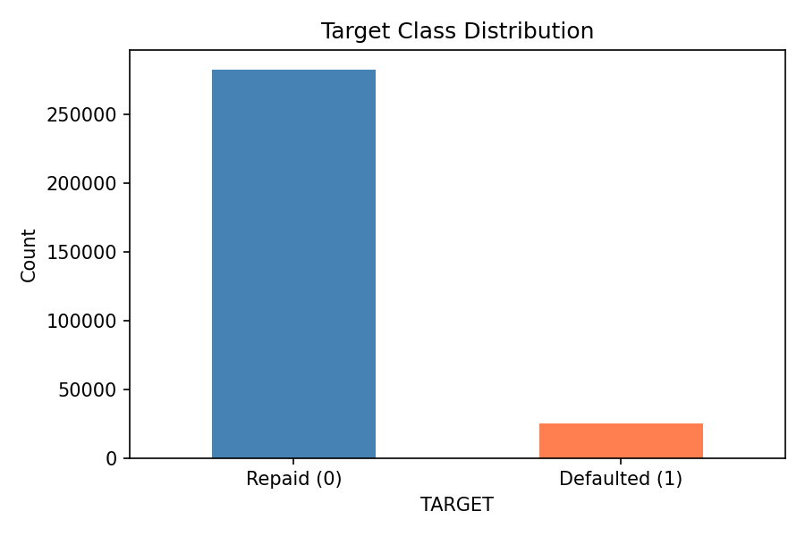
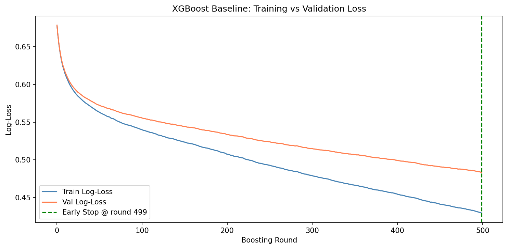
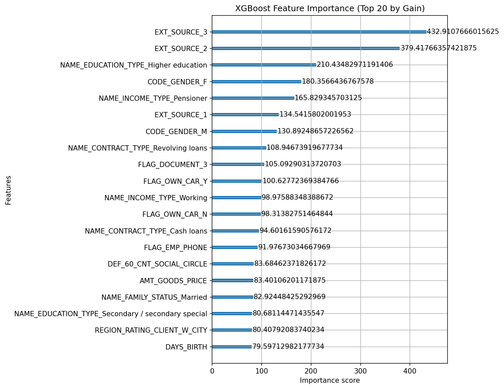
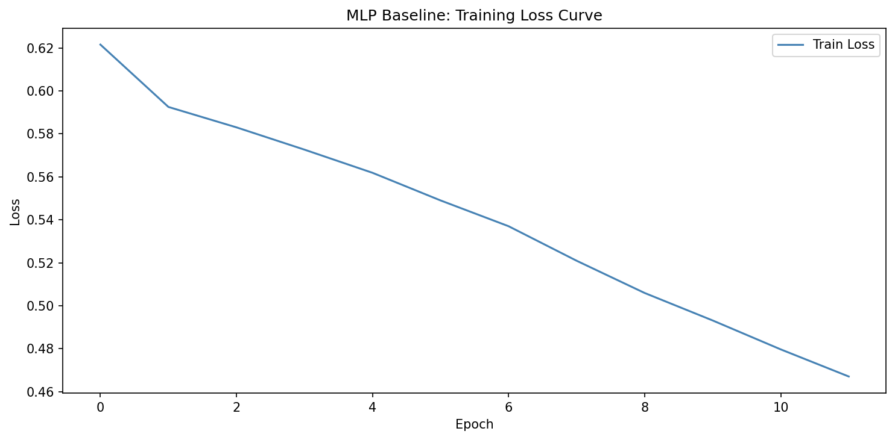
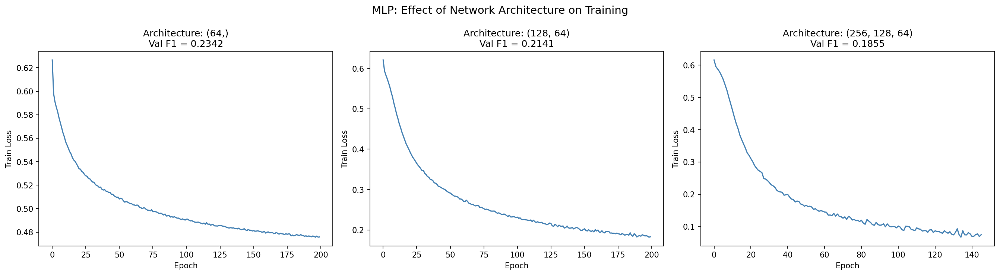
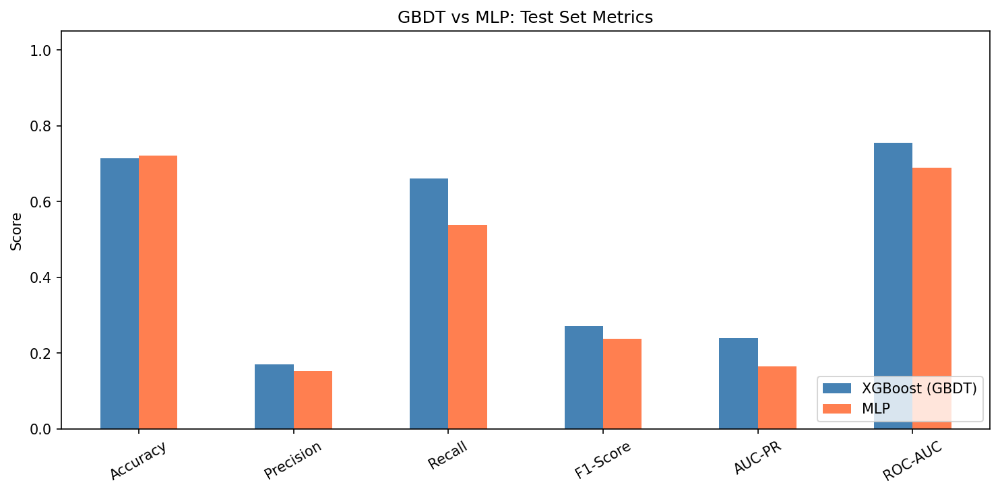

# Assignment 2: From Trees to Neural Networks
**Dataset:** Home Credit Default Risk (`application_train.csv`)
**Task:** Predict loan default (TARGET=1) vs repayment (TARGET=0)
**Code:** https://github.com/shreyarora2198/aml_assignments/blob/main/assignment2.ipynb

---

## 1. Introduction

This assignment compares Gradient Boosted Decision Trees (XGBoost) and Multi-Layer Perceptrons (MLP) on the Home Credit Default Risk dataset — 307,511 loan applications, 122 features, predicting whether an applicant will default. Only `application_train.csv` was used. The defining challenge is severe class imbalance: only 8.1% of applicants defaulted, making accuracy unreliable. F1-score and AUC-PR are used as primary metrics throughout.

## 2. Methods

### 2.1 Exploratory Data Analysis

- **Shape:** 307,511 rows × 122 columns (65 float, 41 int, 16 categorical)
- **Target:** 282,686 repaid (0) vs 24,825 defaulted (1) — 8.1% positive class
- **Missing values:** 67 columns had missing data; several apartment features missing >60%

A majority-class predictor gets 91.9% accuracy while detecting zero defaults — motivating F1 and AUC-PR as primary metrics.

### 2.2 Data Preparation

All preprocessing followed strict no-leakage order: **split first, then fit transformers on train only**.

1. **Drop high-missing columns** (>60% missing) — these add noise with minimal signal
2. **Split 70/15/15** with stratification to preserve 8.1% default rate in all splits
3. **Impute** numeric with median (robust to income/loan outliers); categorical with mode — fit on train only
4. **One-hot encode** 16 categorical columns — label encoding avoided as it implies false ordinal relationships; val/test realigned with `.reindex()` to match train columns
5. **StandardScaler for MLP only** — fit on train, applied to val/test. Trees are rank-based and scale-invariant; MLPs use gradient descent where unscaled features cause unstable training

## 3. Gradient Boosted Decision Trees (XGBoost)

### 3.1 Baseline & Class Imbalance Fix

Without adjustment, XGBoost achieved Val F1≈0.005 — always predicting "repaid". Fix: `scale_pos_weight=11.39` (neg/pos ratio), which penalizes missing a default 11.39× more. Val F1 improved to ~0.27.

Baseline config: `n_estimators=500, lr=0.1, max_depth=6, subsample=0.8, colsample_bytree=0.8`. Early stopping (`rounds=30`) prevented overfitting automatically.

### 3.2 Parameter Exploration

**Learning rate** (0.01, 0.1, 0.3 with n_estimators=300):

| LR | Best Round | Val F1 |
|---|---|---|
| 0.01 | 299 (capped) | 0.2583 |
| 0.1 | 299 (capped) | 0.2739 |
| 0.3 | 298 (capped) | 0.2665 |

All three hit the cap — they needed more trees. `lr=0.1` was most efficient per tree. Lower learning rates reduce each tree's contribution (higher bias per tree) but require proportionally more estimators — a direct bias-variance tradeoff.

**Hyperparameter tuning** (RandomizedSearchCV, 10 candidates × 3-fold CV on 30% subsample for speed):

Best params: `max_depth=7, lr=0.05, subsample=0.9, colsample_bytree=0.9, reg_alpha=1.0, reg_lambda=5.0` — CV F1: 0.2683. Final model retrained on full 215k samples: **Val F1=0.2651** in 4.1s.

### 3.3 Feature Importance

`EXT_SOURCE_3/2/1` (external credit bureau scores) dominate by a large margin. These scores are computed by third-party agencies that aggregate repayment history across all lenders — they encode years of credit behavior in a single number, which is why they outweigh all other features combined. Secondary features: education level (proxy for income stability), gender, age (`DAYS_BIRTH` — older applicants default less), and `DEF_60_CNT_SOCIAL_CIRCLE` (defaults among peers — may capture correlated risk within a borrower's social environment).

## 4. Multi-Layer Perceptron (MLP)

### 4.1 Baseline & Class Imbalance Fix

`MLPClassifier` has no `scale_pos_weight`. Instead `compute_sample_weight('balanced')` assigns weight 6.19 to defaults vs 0.54 to repayments, amplifying gradient updates from minority class errors. Without this, Val F1≈0.

Baseline: `hidden_layer_sizes=(128,64), activation=relu, lr=0.001, max_iter=100, early_stopping=True`. Achieved **Val F1=0.2464** in 12 epochs. Early stopping triggered prematurely — it monitors accuracy internally, which is a poor metric under class imbalance. The loss curve (below) is still descending at epoch 12, confirming the model had not converged — the gap between potential and actual performance is a direct consequence of using the wrong stopping criterion.

### 4.2 Architecture & Activation Exploration

**Architecture** (200 epochs, early stopping off):

| Architecture | Epochs | Val F1 |
|---|---|---|
| (64,) | 200 | **0.2342** |
| (128, 64) | 200 | 0.2141 |
| (256, 128, 64) | 146 | 0.1855 |

Simpler architecture won — deeper networks need more data/epochs to converge on tabular data and are prone to overfitting.

**Activation × Learning Rate:**

| | LR=0.001 | LR=0.01 | LR=0.1 |
|---|---|---|---|
| relu | 0.2141 | 0.2285 | **0.0000** |
| tanh | 0.1777 | **0.2438** | 0.2115 |

`relu+lr=0.1` completely failed (F1=0.0) — aggressive updates caused dying ReLU neurons. `tanh` survived `lr=0.1` due to bounded outputs (−1 to +1) dampening extreme updates. Both activations at `lr=0.001` hit the epoch cap — too slow to converge.

**Tuning** (10 candidates × 3-fold CV, 30% subsample, `lr=0.1` excluded): Best params `(64,), relu, lr=0.001, max_iter=100` — CV F1: 0.4257. Final model on full train: **Val F1=0.2311** in 53s. The large gap between CV F1 and final Val F1 suggests the MLP was unstable across splits and sensitive to the reduced search setting — the subsample folds may have been more favorable to this architecture than the full dataset distribution.

## 5. GBDT vs MLP Comparison

| Metric | XGBoost | MLP |
|---|---|---|
| Accuracy | 0.7141 | 0.7216 |
| Precision | 0.1712 | 0.1528 |
| Recall | **0.6617** | 0.5389 |
| F1-Score | **0.2720** | 0.2381 |
| AUC-PR | **0.2402** | 0.1648 |
| ROC-AUC | **0.7557** | 0.6895 |
| Train Time | **4.1s** | 53.0s |

**XGBoost wins on every meaningful metric** — 14% higher F1, 46% higher AUC-PR, 10% higher ROC-AUC, 13× faster. MLP's marginally higher accuracy (0.722 vs 0.714) is misleading — it simply predicts fewer defaults, missing more risky applicants.

**GBDT preferred for:** structured tabular data, interpretability needs, missing values, fast training. XGBoost has a strong **inductive bias** toward axis-aligned splits — well-suited for heterogeneous tabular features where different columns have completely different scales and semantics. Trees handle non-smooth, discontinuous feature relationships naturally. **MLP preferred for:** unstructured data (images, text), very large datasets where deep architectures can learn hierarchical representations unavailable to trees.

**Interpretability:** XGBoost `feature_importances_` is auditable. MLP's 23,000+ weights are uninterpretable — a black box.

**Categorical/missing:** XGBoost handles missing values natively and works well with encoded categorical features; in this project, categorical variables were one-hot encoded for both models. MLP required both explicit encoding and imputation.

**Sensitivity:** MLP failed completely at `relu+lr=0.1` (F1=0). XGBoost with early stopping degrades gracefully.

## 6. Discussion

**Bias-Variance:** The XGBoost loss curve shows train loss consistently below val loss — a moderate gap indicating controlled overfitting. L1/L2 regularization and early stopping prevent the gap from widening further. For MLP, the loss curve is still descending when training ends — this is a high-bias (underfitting) signature, not overfitting. The model lacks sufficient training time to reach its capacity. Increasing `max_iter` would reduce bias but risk variance increasing in later epochs.

**Limitations:** (1) Only `application_train.csv` used — joining bureau/credit card tables would improve both models. (2) Hyperparameter search used a 30% subsample. (3) sklearn's MLPClassifier is more limited than PyTorch for deep learning experimentation; a PyTorch implementation with GPU training and more flexible optimization could likely narrow the gap. (4) Fixed 0.5 threshold; tuning it lower could improve recall.

## 7. AI Tool Disclosure

**AI tools used:** Claude Code (Anthropic) — scaffolded notebook structure, debugged errors (XGBoost API changes, class imbalance), and explained concepts on request.

**Personal contributions:** Dataset selection, running and interpreting all outputs, identifying class imbalance from EDA, preprocessing threshold decisions, analysis of all plots and metrics, report writing.
