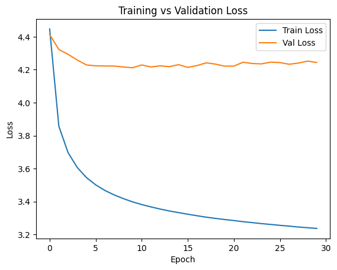
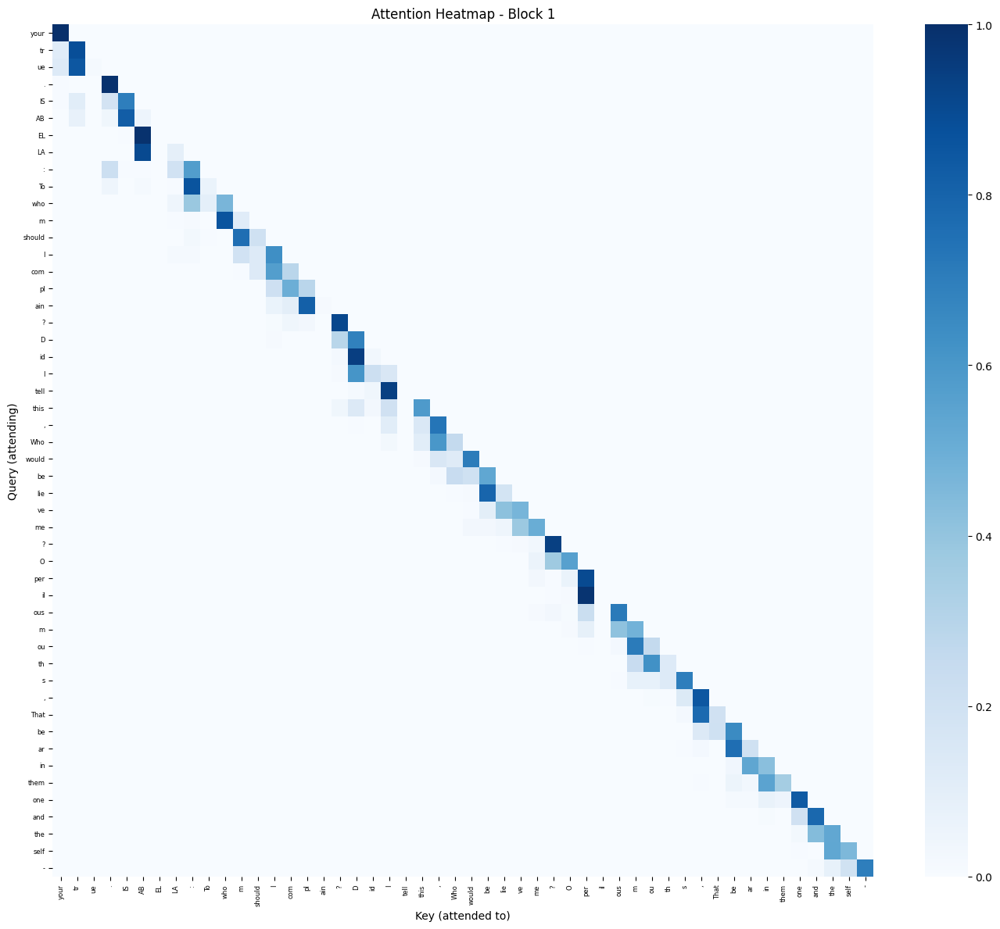
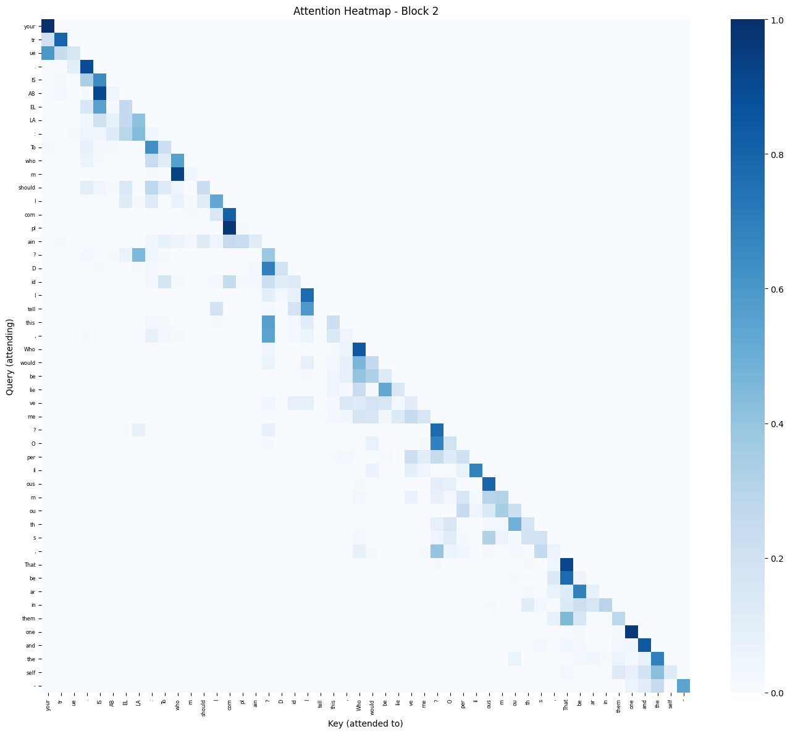

# Assignment 3: Transformer is All You Need

## 1. Introduction

This report describes the implementation and analysis of a Tiny Transformer language model trained on the Tiny Shakespeare corpus for next-token prediction. The model was built entirely from scratch using PyTorch, implementing all core components of the Transformer architecture: sinusoidal positional encoding, causal masked self-attention, RMSNorm, feed-forward networks, and residual connections. The goal was to understand the internal mechanics of modern Large Language Models by building and training a minimal version from the ground up.

**GitHub Repository:** [transformer.ipynb](https://github.com/shreyarora2198/aml_assignments/blob/main/aml_assignment3/transformer.ipynb)

## 2. Data Preparation

**Dataset:** The Tiny Shakespeare corpus (~1.1M characters) consisting of Shakespeare play dialogue with character names, speech, and stage directions.

**Tokenization:** A Byte Pair Encoding (BPE) tokenizer was trained directly on the corpus using the HuggingFace `tokenizers` library with a vocabulary size of 500. BPE captures meaningful subword units rather than individual characters — frequent words like "speak" become single tokens, while rarer words are split into reusable pieces (e.g., "spoken" → ["sp", "oken"]). The full text tokenized to **447,512 tokens** — significantly fewer than the 1,115,394 character count — demonstrating BPE's compression benefit (~2.5 characters per token).

**Sequence Formatting:** The token stream was split into overlapping fixed-length sequences of 50 tokens using a stride of 10. For each sequence, the input is tokens [i : i+50] and the target is tokens [i+1 : i+51], enabling next-token prediction. Overlapping sequences (stride < seq_len) expose the model to more diverse context windows and significantly increase training data volume. This produced **44,747 total sequences** — approximately 5× more than non-overlapping chunking.

**Data Split:** 80% training (35,797 sequences) and 20% validation (8,950 sequences). DataLoader used batch_size=32, shuffle=True for training, shuffle=False for validation.

## 3. Model Architecture

The model is a **decoder-only Transformer** (similar in spirit to GPT), processing tokens left-to-right with causal masking. The full forward pass is:

```
Input tokens [batch=32, seq=50]
    → Token Embedding       [32, 50, 64]
    → + Positional Encoding [32, 50, 64]
    → TransformerBlock × 2  [32, 50, 64]
    → RMSNorm               [32, 50, 64]
    → Linear head           [32, 50, 500]
```

**Token Embedding:** `nn.Embedding(500, 64)` maps each token ID to a 64-dimensional learned float vector, updated during training so semantically similar tokens converge to nearby regions of embedding space.

**Sinusoidal Positional Encoding:** Self-attention is permutation-invariant — without position information the model cannot distinguish "the king speaks" from "speaks the king." Sinusoidal encodings inject position information by adding fixed vectors to token embeddings: PE(pos, 2i) = sin(pos / 10000^(2i/d)) and PE(pos, 2i+1) = cos(pos / 10000^(2i/d)). Each position gets a unique signature across the 64 dimensions.

**Self-Attention with Causal Mask:** Each block computes Q, K, V as linear projections of the input, then: scores = QKᵀ / √64, followed by a causal mask setting scores[i,j] = -∞ for j > i, then softmax and weighted sum of V. The mask ensures each token only attends to past tokens, enforcing autoregressive generation.

**Feed-Forward Network:** A position-wise two-layer MLP: `Linear(64→128) → ReLU → Linear(128→64)`. The 2× expansion allows the model to capture non-linear feature interactions.

**RMSNorm + Residual Connections:** Pre-norm residuals: `x = x + sublayer(RMSNorm(x))`. RMSNorm normalizes by root mean square without subtracting the mean — simpler than LayerNorm and used in modern architectures (LLaMA, Mistral). Residuals allow gradients to flow directly through the network.

**Output Head:** `Linear(64→500)` projects each token's hidden state to 500 vocabulary logits.

**Total parameters: ~500K** — lightweight enough to train on CPU in under 30 minutes.

## 4. Training

**Setup:** Cross-entropy loss, Adam optimizer (lr=1e-3), 30 epochs, random seed=42 for reproducibility.



*Figure 1: Training and validation loss over 30 epochs.*

| Epoch | Train Loss | Val Loss | Val PPL |
|-------|-----------|---------|---------|
| 1     | 4.45      | 4.41    | 82.3    |
| 5     | 3.55      | 4.23    | 68.7    |
| 10    | 3.40      | 4.21    | 67.4    |
| 20    | 3.29      | 4.22    | 68.0    |
| 30    | 3.24      | 4.24    | 69.5    |

**Final Validation Perplexity: 69.51** — computed as exp(4.244). This means the model is on average uncertain between ~70 equally likely next tokens. For context: a random model over vocab=500 yields PPL=500, while GPT-2 achieves PPL≈20-30 on similar data. The gap is expected — our model has ~500K parameters vs GPT-2's 117M. With 5× more training data from overlapping sequences (44,747 vs 8,950), perplexity improved modestly compared to the non-overlapping baseline (70.83).

**Training dynamics:** Train loss decreased steadily across all 30 epochs from 4.45 to 3.24. Val loss converged rapidly by epoch 10 (4.21) and plateaued thereafter, with minor fluctuations around 4.22-4.24 — indicating the model reached its capacity limit early. The overlapping sequence construction provides richer training signal since each token appears in multiple context windows, contributing to the faster early convergence compared to the non-overlapping setup.

## 5. Attention Visualization & Analysis

Attention weights were extracted from both Transformer blocks for a sample validation sequence beginning with subword tokens: `"? O per il ous m ou th s That be ar in them one and the self..."`.



*Figure 2: Attention heatmap — Block 1. Rows = query tokens (attending), columns = key tokens (attended to).*



*Figure 3: Attention heatmap — Block 2.*

**1. Causal (lower-triangular) structure:** The upper triangle of both heatmaps is entirely zero — the causal mask functions correctly. Token at position i attends only to positions ≤ i.

**2. Strong diagonal dominance:** Both blocks show peak attention on the diagonal — each token attends most strongly to itself. One plausible interpretation is that in a small single-head model with limited capacity, the attention mechanism has not learned to strongly differentiate between attending to self versus neighbors, defaulting to near-identity behavior. However, since attention weights are learned, this pattern could also reflect a genuine signal: the current token's representation is the most useful context for predicting the next token at this stage of training. Either way, the diagonal bias is a commonly observed phenomenon in shallow attention models.

**3. Local neighborhood clusters:** Attention spreads to immediately adjacent tokens (positions i-1, i-2). The token "That" attends to preceding punctuation and nearby subword pieces, capturing local syntactic context. This local bias is expected in shallow 2-block models — deeper models develop longer-range dependencies.

**4. Connector tokens attend more broadly:** Tokens like "and", "the", and "of" show more distributed attention compared to content words, consistent with their role as contextual connectors.

**5. Block 1 vs Block 2:** Block 1 shows sharper diagonal-concentrated attention, identifying immediate neighbors. Block 2 shows slightly more distributed weights spreading 2-3 positions back, suggesting the second layer builds on Block 1's local patterns to capture broader context.

**6. Subword fragmentation:** BPE splits rare words into pieces (e.g., "perilous" → ["per", "il", "ous"]). These fragments attend strongly to each other in the heatmap — an emergent behavior where the model re-assembles split words through attention.

## 6. Discussion & Reflection

**Attention patterns:** The dominant pattern is diagonal self-attention with local clusters. The model has not developed long-range attention — tokens rarely attend beyond 3-4 positions back. This reflects limited depth (2 blocks) and width (embed_dim=64). Larger models like GPT-2 (12 blocks, embed_dim=768) develop head specialization with syntactic and semantic attention heads — behaviors this tiny model cannot support.

**Hyperparameter impact:** `embed_dim=64` had the greatest impact as the bottleneck through which all information flows in Q, K, V projections. A larger embed_dim (128 or 256) would provide more expressive capacity. Learning rate (1e-3) was stable — Adam's adaptive moments absorb sensitivity. `seq_len=50` was sufficient for short utterances but insufficient for scene-level structure.

**Sequence stride experiment:** Two configurations were compared. Non-overlapping sequences (stride=50) produced 8,950 training sequences and final PPL=70.83. Overlapping sequences (stride=10) produced 44,747 sequences and final PPL=69.51. The improvement is modest (~2%) because the model's capacity (embed_dim=64, 2 blocks) is the binding constraint — more data helps but cannot overcome architectural limits. The best val loss occurred at epoch 10 (PPL=67.4) in both runs, after which the model plateaued, confirming that capacity rather than data quantity is the bottleneck.

**Attention evolution during training:** Early training (PPL≈144) shows nearly uniform attention — no strong preferences. As training progresses the diagonal sharpens, reflecting the learned signal that a token's own embedding predicts its context best. By epoch 30 the local cluster pattern stabilizes, capturing n-gram-like statistics.

**Role of positional encodings:** Without them, self-attention is permutation-invariant — identical outputs for any token ordering. The model could not learn subject-verb order or Shakespeare's dialogue structure (character name → colon → speech). Sinusoidal encodings give each position a unique fingerprint, enabling order-dependent pattern learning.

**Runtime and memory:** The dominant bottleneck is the attention score matrix (O(n²) in sequence length): `Q @ Kᵀ` produces [32, 50, 50] per block — trivial at seq_len=50 but expensive at GPT-2's seq_len=1024. Each epoch took ~30-60 seconds on CPU. Total model size ~2MB.

**Text generation:** With temperature sampling (T=0.8), the model generated: *"To be or not I . RO S I R S E P R INC E : W hi le an I . To heart is a ble to stand ' d Rome o p in ion where in of this de ed . RO M E O : Come , let them on"*. This output exhibits several interesting properties: the model correctly generates Shakespeare-style character headers ("PRINCE:", "ROMEO:"), uses Elizabethan vocabulary ("whereof", "deed", "stand"), and produces dialogue-like structure. However, subword fragmentation from BPE (e.g., "R INC E" for "RINCE", "a ble" for "able") disrupts readability, and grammatical coherence breaks beyond a few tokens. This confirms the model learned high-level structural patterns (dialogue format, character names) and vocabulary statistics, but not long-range syntactic dependencies.

## 7. AI Tool Usage Disclosure

This assignment was completed with significant assistance from Claude (Anthropic's AI assistant, Claude Code), which served as an interactive tutor — explaining concepts (self-attention, RMSNorm, BPE, PyTorch broadcasting), identifying bugs, and guiding architecture decisions step by step.

**Personal contributions:** Writing all code through guided Q&A (not copy-pasting); running all experiments; providing the conceptual observations behind the discussion section; making hyperparameter decisions.

**Claude's contributions:** Explaining concepts; identifying syntax/logic bugs; structuring the report from my answers; providing benchmark comparisons.

The analysis reflects understanding developed through hands-on implementation, with Claude helping formalize observations made during experimentation.
