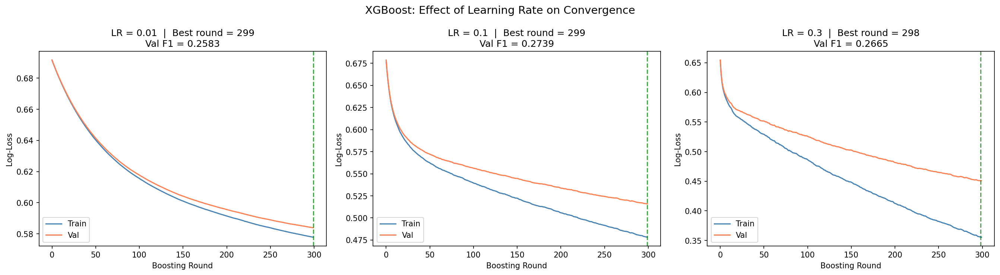
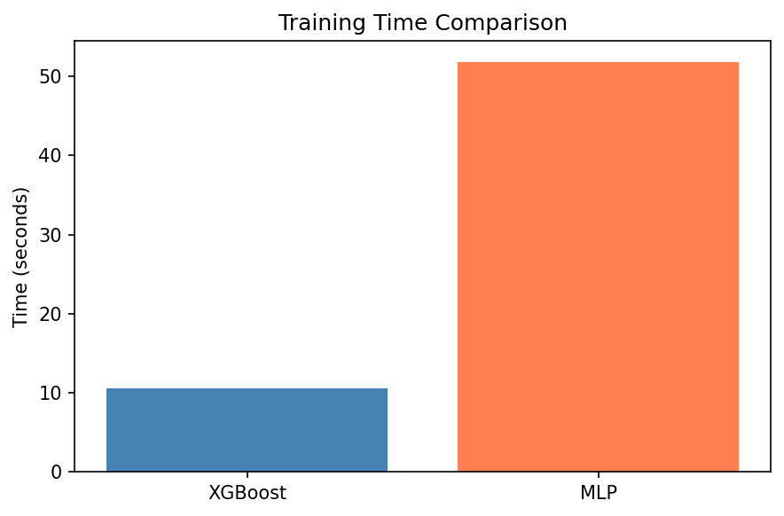
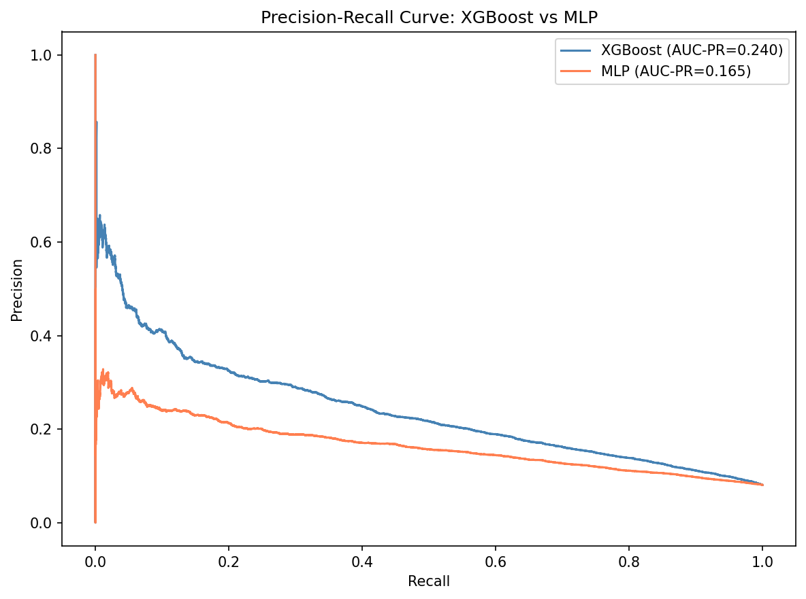

# Assignment 2: From Trees to Neural Networks
**Dataset:** Home Credit Default Risk (`application_train.csv`)
**Task:** Binary classification — predict loan default (TARGET = 1) vs repayment (TARGET = 0)
**Models:** XGBoost (GBDT) vs MLPClassifier (Neural Network)

---

## 1. Introduction

This assignment compares two fundamentally different modeling paradigms — Gradient Boosted Decision Trees (GBDT) via XGBoost, and Multi-Layer Perceptrons (MLP) — on the Home Credit Default Risk dataset. The task is to predict whether a loan applicant will default on their repayment, a high-stakes binary classification problem with real-world financial consequences.

The Home Credit dataset contains 307,511 loan applications described by 122 features, including demographic information, credit history, and behavioral data. The dataset was sourced from the Kaggle competition and only the main application file (`application_train.csv`) was used, as it provides sufficient signal for this comparative study.

---

## 2. Methods

### 2.1 Exploratory Data Analysis

Initial exploration revealed the following key properties of the dataset:

- **Shape:** 307,511 rows × 122 columns
- **Feature types:** 65 float64, 41 int64, 16 object (categorical)
- **Target distribution:** 282,686 repaid (0) vs 24,825 defaulted (1)
- **Class imbalance:** Only 8.1% of applicants defaulted

The severe class imbalance is the defining characteristic of this dataset. A naive model that always predicts "repaid" would achieve 91.9% accuracy while detecting zero defaults. This makes accuracy an unreliable metric — we prioritize F1-score and AUC-PR throughout this analysis, as they measure performance on the minority class.

Additionally, 67 of 122 columns contained missing values, with several apartment/building-related features missing over 60% of their values. These missing values are structurally absent (they only exist for certain housing types) rather than randomly missing.

### 2.2 Data Preparation

**Step 1 — Drop high-missing columns:**
Columns missing more than 60% of their values were dropped before any other preprocessing. These columns provide minimal signal and retaining them would introduce noise. This reduced the feature set from 122 to a smaller set.

**Step 2 — Train / Validation / Test Split (70 / 15 / 15):**
The dataset was split *before* any imputation, encoding, or scaling to prevent data leakage. Stratified splitting was used to preserve the 8.1% default rate across all three splits.

| Split | Size | Default Rate |
|---|---|---|
| Train | ~215,257 | 8.1% |
| Validation | ~46,127 | 8.1% |
| Test | ~46,127 | 8.1% |

**Step 3 — Imputation:**
All preprocessing transformers were fit exclusively on the training set and applied to validation and test sets using the training statistics — this is critical to prevent data leakage.

- Numeric features: imputed with **median** (robust to outliers — income and loan amounts have extreme values that would skew mean imputation)
- Categorical features: imputed with **most frequent value**

**Step 4 — One-Hot Encoding:**
The 16 categorical columns were one-hot encoded. Label encoding was avoided for nominal categoricals because it would incorrectly imply an ordinal relationship (e.g., telling the model "Male > Female" numerically). After encoding, validation and test columns were realigned to match the training set structure using `.reindex()` to handle rare categories absent in some splits.

**Step 5 — Feature Scaling (for MLP only):**
StandardScaler was applied to create a separate scaled dataset for MLP training. Tree-based models like XGBoost do not require scaling because splits are rank-based (not distance-based) — feature magnitude is irrelevant. MLPs use gradient descent, where features on vastly different scales cause gradient imbalance and unstable training. The scaler was fit on training data only.

---

## 3. Gradient Boosted Decision Trees (XGBoost)

### 3.1 Addressing Class Imbalance

Without any adjustment, XGBoost achieved Val F1 ≈ 0.005 — effectively predicting "repaid" for every applicant. This is a consequence of class imbalance: minimizing log-loss on a 92/8 split rewards always predicting the majority class.

The fix was `scale_pos_weight = 11.39` (ratio of negative to positive class in training data). This parameter reweights the loss function so that misclassifying a default costs 11.39× more than misclassifying a repayment, forcing the model to learn patterns in the minority class.

After applying this fix, Val F1 improved dramatically to ~0.27.

### 3.2 Baseline Model

The baseline XGBoost model was trained with the following configuration:

| Parameter | Value | Rationale |
|---|---|---|
| n_estimators | 500 | Upper bound; early stopping determines actual count |
| learning_rate | 0.1 | Balanced convergence speed and generalization |
| max_depth | 6 | Controls tree complexity; prevents overfitting |
| subsample | 0.8 | Row subsampling per tree; reduces overfitting |
| colsample_bytree | 0.8 | Feature subsampling per tree; reduces overfitting |
| scale_pos_weight | 11.39 | Corrects class imbalance |

Early stopping with `early_stopping_rounds=30` was used to halt training when validation log-loss stopped improving, preventing overfitting and reducing unnecessary computation.

### 3.3 Hyperparameter Tuning

RandomizedSearchCV was used to efficiently search the hyperparameter space. Rather than exhaustively trying every combination (GridSearchCV), it randomly samples 10 combinations from the search space and evaluates each using 3-fold cross validation — totaling 30 training jobs.

For each candidate combination, the training data is split into 3 chunks. The model trains on 2 chunks and validates on the third, rotating 3 times and averaging the F1 scores. This gives a more reliable performance estimate than a single train/val split.

To keep computation feasible on a large dataset (215k rows), the search was run on a stratified 30% subsample (~65k rows). Parameter rankings on a representative subsample transfer reliably to the full dataset. The winning parameters were then used to retrain the final model on the full training set.

The search covered:
- `max_depth`: [3, 5, 7]
- `learning_rate`: [0.05, 0.1, 0.2]
- `n_estimators`: [100, 200] (early stopping finds the true optimum)
- `subsample`: [0.7, 0.9]
- `colsample_bytree`: [0.7, 0.9]
- `reg_alpha` (L1): [0, 0.1, 1.0]
- `reg_lambda` (L2): [1.0, 5.0]

The best parameters found were:

| Parameter | Best Value |
|---|---|
| max_depth | 7 |
| learning_rate | 0.05 |
| n_estimators | 100 (+ early stopping) |
| subsample | 0.9 |
| colsample_bytree | 0.9 |
| reg_alpha | 1.0 |
| reg_lambda | 5.0 |

**Best CV F1: 0.2683**

These parameters were then used to retrain the final model on the full training set (215k samples).

### 3.4 Effect of Learning Rate

Three learning rates were compared (0.01, 0.1, 0.3) with n_estimators=300:

| Learning Rate | Best Round | Val F1 |
|---|---|---|
| 0.01 | 299 (capped) | 0.2583 |
| 0.1 | 299 (capped) | 0.2739 |
| 0.3 | 298 (capped) | 0.2665 |

All three models hit the estimator cap without triggering early stopping, indicating further improvement was possible with more trees. `lr=0.1` achieved the best Val F1 within the same tree budget, demonstrating the most efficient learning. Lower learning rates require proportionally more trees to converge — `lr=0.01` with 300 trees is undertrained compared to `lr=0.1` with 100 trees.

This reflects the **bias-variance tradeoff**: a lower learning rate makes each tree's contribution smaller (higher bias per tree), requiring more trees to achieve low overall bias, but each individual tree is less likely to overfit (lower variance).

### 3.5 Feature Importance

The three external credit scores (`EXT_SOURCE_3`, `EXT_SOURCE_2`, `EXT_SOURCE_1`) dominate feature importance by a large margin, confirming that third-party creditworthiness assessments are the strongest predictors of default. This aligns with real-world lending practice where bureau scores carry the most weight in credit decisions.

Notable secondary features include:
- `NAME_EDUCATION_TYPE_Higher education` — university-educated applicants default less, likely due to higher income stability
- `CODE_GENDER_F` / `CODE_GENDER_M` — gender is predictive in this dataset; female applicants show lower historical default rates
- `DEF_60_CNT_SOCIAL_CIRCLE` — number of people in the applicant's social circle who defaulted; a social network effect on credit behavior
- `DAYS_BIRTH` — older applicants tend to default less
- `AMT_GOODS_PRICE` — the price of the goods the loan was taken for

This interpretability is a key advantage of GBDT over MLP — feature importance gives direct insight into what the model learned, which is valuable for regulatory compliance and business decision-making.

---

## 4. Multi-Layer Perceptron (MLP)

### 4.1 Addressing Class Imbalance

sklearn's `MLPClassifier` does not support `scale_pos_weight` like XGBoost. Instead, `compute_sample_weight('balanced')` was used to assign per-sample weights before training. This gives each default sample a weight of 6.19 vs 0.54 for repayment samples, making gradient updates from minority class mistakes proportionally larger. Without this, the MLP achieved Val F1 ≈ 0 by predicting "repaid" for every applicant.

### 4.2 Baseline Model

The baseline MLP was trained with the following configuration:

| Parameter | Value |
|---|---|
| hidden_layer_sizes | (128, 64) |
| activation | relu |
| learning_rate_init | 0.001 |
| max_iter | 100 |
| early_stopping | True (validation_fraction=0.1) |

**Val F1: 0.2464** — achieved in only 12 epochs before early stopping triggered.

The training loss curve showed the model was still improving at epoch 12, suggesting early stopping was triggered prematurely due to accuracy (not F1) being used as the internal stopping metric — a limitation of sklearn's MLPClassifier with imbalanced data.

### 4.3 Effect of Network Architecture

Three architectures were compared with `max_iter=200` and early stopping disabled to observe full training dynamics:

| Architecture | Layers | Epochs | Val F1 |
|---|---|---|---|
| (64,) | 1 hidden layer, 64 neurons | 200 (capped) | **0.2342** |
| (128, 64) | 2 hidden layers | 200 (capped) | 0.2141 |
| (256, 128, 64) | 3 hidden layers | 146 | 0.1855 |

The simplest architecture `(64,)` achieved the best Val F1. This is a counterintuitive but important result — deeper networks are not always better. On structured tabular data, adding layers introduces more parameters to optimize, requiring more data and epochs to converge. The `(256, 128, 64)` model stopped at epoch 146 (likely due to convergence) but achieved the worst F1, suggesting it overfit or got stuck in a poor local minimum. This aligns with the finding from tuning that `(64,)` was the best architecture.

### 4.4 Effect of Activation Function and Learning Rate

| Activation | LR=0.001 | LR=0.01 | LR=0.1 |
|---|---|---|---|
| relu | 0.2141 (200 ep) | 0.2285 (111 ep) | 0.0000 (28 ep) |
| tanh | 0.1777 (200 ep) | 0.2438 (30 ep) | 0.2115 (12 ep) |

Key observations:
- **relu + lr=0.1 completely failed (F1=0.0000)** — too aggressive, the model diverged and reverted to predicting the majority class
- **tanh was more stable at lr=0.1** — tanh's bounded output (-1 to +1) dampens extreme weight updates, making it more tolerant of higher learning rates
- **Best overall: tanh + lr=0.01 (F1=0.2438)** — converged in just 30 epochs, efficient and accurate
- Both activations at lr=0.001 hit the 200-epoch cap without converging — the learning rate was too small

### 4.5 Hyperparameter Tuning

RandomizedSearchCV (10 iterations, 3-fold CV) was run on the same 30% stratified subsample used for XGBoost tuning, for consistency. `lr=0.1` was excluded from the search after 5.4 showed it causes relu networks to completely fail.

**Best parameters found:**

| Parameter | Best Value |
|---|---|
| hidden_layer_sizes | (64,) |
| activation | relu |
| learning_rate_init | 0.001 |
| max_iter | 100 |

**Best CV F1: 0.4257**

Notably, the simpler single-layer architecture `(64,)` outperformed deeper networks on the subsample. This suggests the dataset does not require deep feature hierarchies — the patterns are relatively direct and a shallow network generalizes better by avoiding overfitting. The final model was retrained on the full training set (215k samples) using these parameters, achieving **Val F1 = 0.2311** in 53 seconds (100 epochs). The gap between CV F1 (0.4257) and final Val F1 (0.2311) suggests the model underfit on the full dataset within the 100-epoch budget — a limitation of sklearn's MLPClassifier compared to dedicated deep learning frameworks like PyTorch or TensorFlow, which offer better convergence control and GPU acceleration.

---

## 5. GBDT vs MLP Comparison

### 5.1 Test Set Metrics

| Metric | XGBoost (GBDT) | MLP |
|---|---|---|
| Accuracy | 0.7141 | 0.7216 |
| Precision | 0.1712 | 0.1528 |
| Recall | **0.6617** | 0.5389 |
| F1-Score | **0.2720** | 0.2381 |
| AUC-PR | **0.2402** | 0.1648 |
| ROC-AUC | **0.7557** | 0.6895 |
| Training Time | **4.10s** | 53.00s |

### 5.2 Analysis

**XGBoost outperforms MLP on every meaningful metric** — higher F1 (0.272 vs 0.238), higher AUC-PR (0.240 vs 0.165), and higher ROC-AUC (0.756 vs 0.690). Crucially, XGBoost achieves much higher Recall (0.662 vs 0.539), meaning it catches significantly more actual defaults — the most important outcome in a credit risk setting.

**MLP has marginally higher Accuracy (0.722 vs 0.714)** — but this is misleading. Accuracy rewards predicting the majority class. MLP's higher accuracy with lower recall means it is more conservative — predicting fewer defaults, thus appearing more accurate but missing more risky applicants.

**Training time: XGBoost is 13x faster** (4s vs 53s) while producing better results. This is a decisive practical advantage for production deployment and retraining.

### 5.3 Discussion Questions

**When would you prefer GBDT over MLP?**
On structured tabular data with mixed types, missing values, and class imbalance — as in this dataset — GBDT is the better choice. It requires less preprocessing, handles missing values natively, trains faster, and is more interpretable. MLP becomes preferable for unstructured data (images, text, audio) or when the dataset is extremely large and patterns are highly non-linear.

**How does interpretability differ?**
XGBoost provides `feature_importances_` which directly quantifies each feature's contribution to reducing loss. This is essential in regulated industries like finance where models must be explainable to auditors and regulators. MLP is a black box — its 23,000+ weights have no human-interpretable meaning. Techniques like SHAP values can partially explain MLP predictions, but they are computationally expensive and approximate.

**How does each model handle categorical features and missing values?**
XGBoost can handle label-encoded categoricals and missing values natively — it learns which branch to take for NaN values during training. MLP requires explicit one-hot encoding and imputation before training, adding preprocessing complexity and memory cost.

**Which model is more sensitive to hyperparameter choices?**
MLP is significantly more sensitive. A single wrong learning rate (relu + lr=0.1) caused complete failure (F1=0.0). XGBoost with early stopping is robust — it automatically finds the right number of trees and degrades gracefully with suboptimal parameters. MLP also requires feature scaling, correct weight initialization, and the right architecture — each a potential failure point.

---

## 6. Discussion

### Bias-Variance Reflection

**XGBoost:** The final model (max_depth=7, lr=0.05, reg_alpha=1.0, reg_lambda=5.0) shows a moderate bias-variance balance. The regularization terms (L1 and L2) explicitly penalize model complexity, reducing variance. The relatively shallow trees (depth 7 with early stopping at round 99) prevent the model from fully memorizing training data. The gap between train and val loss in the loss curve indicates some overfitting, but it is controlled.

**MLP:** The baseline MLP (64 neurons, lr=0.001) hit its epoch cap without converging — indicating high bias (underfitting). The model did not have enough training time to learn the full complexity of the data. A larger architecture trained for more epochs would reduce bias at the cost of increased variance and training time.

### Limitations

1. Only `application_train.csv` was used. Joining bureau, credit card, and installment payment tables would likely improve both models significantly.
2. Hyperparameter search used a 30% subsample — the true optimal parameters on the full dataset may differ.
3. sklearn's MLPClassifier lacks GPU support and advanced optimizers (Adam with momentum, learning rate scheduling). A PyTorch implementation would likely close the gap with XGBoost.
4. The decision threshold of 0.5 was used for all predictions. Threshold tuning (e.g., lowering to 0.3 to increase recall) could improve F1 further for both models.

---

## 7. AI Tool Disclosure

**AI tools used:** Claude Code (Anthropic) — used to scaffold notebook structure, debug errors, and explain concepts during development.

**Personal contributions:** Data exploration and interpretation of EDA results, hyperparameter selection rationale, bias-variance analysis, report writing, and all visualization interpretation.
